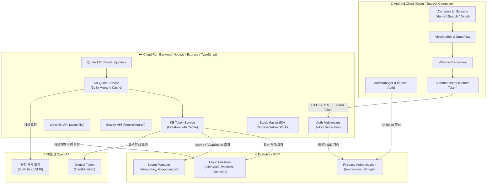

# 📈 KB 증권 관심종목 및 실시간 시세 조회 앱 (KB Watchlist App)

> **KB증권 Open API**와 연동하여 국내 주식 관심종목을 관리하고 실시간 시세(현재가, 전일대비 등락률, 시가/고가/저가/누적거래량)를 조회할 수 있는 안드로이드 네이티브 앱 및 클라우드 중계 백엔드 시스템입니다.  
> **Google Stitch** 디자인 시스템(딥 네이비 & 골드 럭셔리 금융 테마, 모서리가 둥근 미니멀 카드)과 한국 주식 시장 관례(상승 빨강, 하락 파랑)를 따릅니다.

---

## 🏛 전체 시스템 아키텍처



---

## ✨ 핵심 기능

### 1. 안드로이드 모바일 앱 (`android/`)
- **홈 화면 (`HomeScreen`)**:
  - 사용자 관심종목 카드 리스트
  - 대형 현재가, 전일대비 등락률 뱃지 표시
  - **25초 주기 실시간 자동 시세 폴링** (앱이 백그라운드로 전환되면 배터리 및 데이터 절약을 위해 폴링 자동 중지)
- **종목 검색/추가 화면 (`SearchScreen`)**:
  - 디바운스 실시간 검색 (종목명 및 6자리 코드 검색 지원)
  - '추가' 버튼 및 이미 관심종목에 추가된 경우 원형 체크(✔) 아이콘으로 자동 상태 전환
- **종목 상세 화면 (`DetailScreen`)**:
  - 상단 대형 종목 요약 (종목명, 코드, 현재가, 등락률)
  - **2x2 주요 시세 메트릭 그리드**: 시가 | 고가 / 저가 | 누적거래량
  - 하단 "관심종목에서 제거" 둥근 버튼
- **안정성 및 Null-Safety**:
  - KB Open API 키 미등록 또는 장 마감/서버 점검 시에도 앱이 비정상 종료(크래시)되지 않고 `"시세 대기 중"` 안내 렌더링

### 2. Cloud Run 중계 백엔드 (`backend/`)
- **OAuth2 토큰 라이프사이클 관리 (`kbTokenService.ts`)**:
  - 발급된 access token을 Firestore(`tokens/kb`)에 캐싱하여 유효기간(24시간) 동안 재사용
  - 만료 10분 전 자동 재발급을 통한 API 유량 초과 방지
- **시세 캐싱 및 최적화 (`kbQuoteService.ts`)**:
  - 5초 인메모리 캐시를 적용하여 불필요한 중복 호출 방지
  - `bdy_cmpr_ccd` 분석을 통한 등락 부호(`+`, `-`, `0`) 자동 매핑
- **보안 및 격리**:
  - Firebase ID Token 검증을 거친 인증 사용자만 접근 허용
  - `users/{uid}/watchlist/{code}` 구조로 사용자 간 데이터 철저 격리

---

## 📁 프로젝트 폴더 구조

```text
kb-watchlist-app/
├── android/                         # 안드로이드 네이티브 앱 프로젝트
│   ├── app/
│   │   ├── build.gradle.kts
│   │   ├── google-services.json    # Firebase 앱 연동 설정
│   │   └── src/main/java/com/kb/watchlist/
│   │       ├── MainActivity.kt      # 단일 액티비티 진입점 & 네비게이션
│   │       ├── auth/               # Firebase 익명 인증 매니저
│   │       ├── model/              # 시세 및 관심종목 데이터 모델
│   │       ├── network/            # Retrofit2 및 AuthInterceptor
│   │       ├── repository/         # 데이터 계층 레포지토리
│   │       ├── ui/
│   │       │   ├── components/     # StockCard, MetricCard 공통 컴포넌트
│   │       │   ├── screens/        # HomeScreen, SearchScreen, DetailScreen
│   │       │   └── theme/          # Stitch 테마 (Color, Theme, Type)
│   │       └── util/               # Formatters (통화, 등락률, 거래량 포맷팅)
│   └── gradle.properties
├── backend/                         # Cloud Run 중계 서버
│   ├── Dockerfile                  # 멀티스테이지 경량 프로덕션 이미지 빌드
│   ├── package.json
│   ├── tsconfig.json
│   └── src/
│       ├── config.ts               # 환경 변수 및 기본 헤더 설정
│       ├── index.ts                # Express 앱 엔드포인트 바인딩
│       ├── middleware/auth.ts      # Firebase ID Token 인증 미들웨어
│       ├── routes/                 # quote, watchlist, search 라우터
│       └── services/               # kbQuote, kbToken, secretManager, stockMaster
├── firebase.json                    # Firebase 배포 설정
├── firestore.rules                 # Firestore 사용자 격리 보안 규칙
├── PROMPT.md                       # 프로젝트 구축 원본 명세서
└── README.md                       # 본 문서
```

---

## 🚀 빠른 시작 가이드

### 1. 사전 요구사항
- Node.js 20+
- JDK 17+ & Android SDK
- Google Cloud SDK (`gcloud`)
- Firebase CLI (`firebase-tools`)

---

### 2. GCP Secret Manager 키 등록 (Windows PowerShell)

KB증권 포털에서 발급받은 `appKey`와 `appSecret`을 등록합니다.  
윈도우 특유의 개행문자(`\r\n`) 혼입을 방지하기 위해 아래 스크립트로 실행합니다:

```powershell
$PROJECT_ID = "YOUR_PROJECT_ID"
$APP_KEY = "발급받은_APP_KEY"
$APP_SECRET = "발급받은_APP_SECRET"

# kb-app-key 등록
$keyFile = "$env:TEMP\kb_app_key.txt"
[System.IO.File]::WriteAllText($keyFile, $APP_KEY.Trim(), [System.Text.UTF8Encoding]::new($false))
gcloud secrets versions add kb-app-key --data-file="$keyFile" --project=$PROJECT_ID
Remove-Item $keyFile -Force

# kb-app-secret 등록
$secretFile = "$env:TEMP\kb_app_secret.txt"
[System.IO.File]::WriteAllText($secretFile, $APP_SECRET.Trim(), [System.Text.UTF8Encoding]::new($false))
gcloud secrets versions add kb-app-secret --data-file="$secretFile" --project=$PROJECT_ID
Remove-Item $secretFile -Force
```

---

### 3. 백엔드 실행 및 Cloud Run 배포

#### 로컬 빌드 및 실행
```bash
cd backend
npm install
npm run build
npm start
```

#### Cloud Run 배포
```bash
gcloud run deploy kb-watchlist-backend \
  --source=. \
  --region=asia-northeast3 \
  --project=YOUR_PROJECT_ID \
  --allow-unauthenticated
```

---

### 4. 안드로이드 앱 빌드 및 설치

```bash
cd android

# 디버그 APK 빌드 (Windows OneDrive 파일 잠금 방지를 위해 --no-daemon 권장)
./gradlew assembleDebug --no-daemon

# 연결된 실기기 또는 에뮬레이터에 설치
adb install -r app/build/outputs/apk/debug/app-debug.apk
```

---

## 🎨 디자인 시스템 (Google Stitch 스펙)

- **Navy Deep Background**: `#0D1B2A` (차분하고 신뢰감 있는 딥 네이비)
- **Navy Card**: `#1B263B` / **Elevated**: `#24344D`
- **Gold Accent**: `#E5B869` (세련된 골드 포인트)
- **주식 등락 색상 (한국 시장 관례)**:
  - 상승 (Rise): `#E63946` (선명한 레드)
  - 하락 (Fall): `#3B82F6` (차분한 블루)
  - 보합 (Flat): `#9E9E9E` (그레이)
- **모서리 곡률**: 버튼 및 카드 `16dp` 라운딩 통일

---

## 🔒 보안 규칙 (Firestore Security Rules)

```javascript
rules_version = '2';
service cloud.firestore {
  match /databases/{database}/documents {
    // 1. 사용자 관심종목: 본인(UID)만 읽기 및 쓰기 가능
    match /users/{userId}/watchlist/{stockCode} {
      allow read, write: if request.auth != null && request.auth.uid == userId;
    }
    
    // 2. KB 토큰 캐시: 클라이언트 직접 접근 완전 차단 (백엔드 Admin SDK 전용)
    match /tokens/{document=**} {
      allow read, write: if false;
    }
  }
}
```

---

## 📱 실기기 테스트 환경
- **테스트 기기**: Samsung Galaxy S22+ (`SM-S906N`) / Android 14 (One UI 6.1)
- **검증 항목**: 익명 로그인, 실시간 종목 검색, 관심종목 추가/삭제, 홈 화면 25초 폴링 시세 렌더링, 시세 미수신 Fallback 처리 완료
